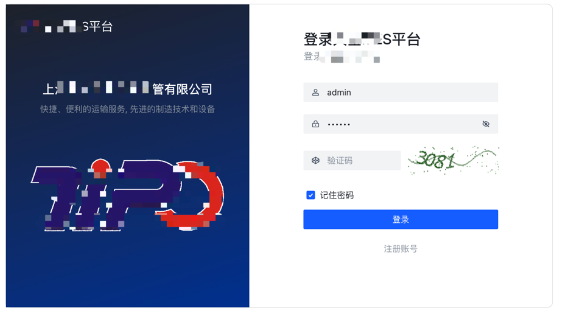
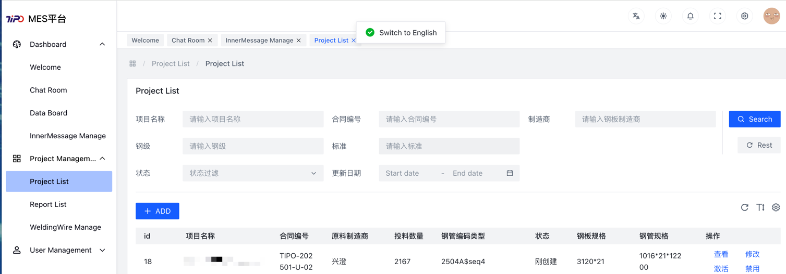

## ✨ **Menu**

- **Dashboard**
  - Welcome Page
  - Data Dashboard
  - Reports
  - Real-Time Monitoring
- **Production Management**
  - Project Management
  - Operational Warnings
  - Work Log Management
- **Process Management**

## ✨ **Features**

- **Project Management**
- **Production process management**
- **Role System**
- **User Management** 

## ✨ **System Platforms**

- **Admin Management Platform**  
  This platform is designed for office administrators. Administrators log in with **admin** or **superadmin** roles.  
  The **admin** role has management platform operation permissions, enabling access to dashboards, live streams, system configurations, etc.  
  The **superadmin** role has full permissions on the web platform, including operations for any workshop data collection, configuration, management, and viewing. This role should be assigned with caution.

- **MES Platform**  
  This platform is designed for workshop production supervisors and workers. Users log in with the **user** role. Each user needs to configure a **phaseTag** (a code for each workshop).  
  User registration must specify the **phaseTag**, and after login, users can only see and operate the management pages for their assigned workshop.
